# CMS Architecture Documentation

## High-Level System Overview

### Layer Breakdown

- **Client Layer**: Web Dashboard, Mobile Apps, API Clients
- **API Gateway**: NGINX (Load Balancing, Rate Limiting, SSL)
- **Application Layer**: NestJS Modules (Auth, RBAC, Content, Workflow, Approval)
- **Data Layer**: PostgreSQL, Redis, S3

---

## Complete System Architecture

```mermaid
graph TB
    subgraph CLIENT_LAYER["📱 Client Layer"]
        WEB[Web Dashboard]
        MOBILE[Mobile Apps]
        API_CLIENT[API Clients]
    end

    subgraph GATEWAY_LAYER["🚪 API Gateway"]
        NGINX[NGINX]
    end

    subgraph APP_LAYER["⚙️ NestJS Application"]
        direction TB
        
        subgraph AUTH_LAYER["🔐 Security"]
            AUTH[Auth]
            RBAC[RBAC Guard]
        end
        
        subgraph CORE_LAYER["👥 Core"]
            USERS[Users]
            ROLES[Roles]
            PERMS[Permissions]
        end
        
        subgraph CMS_LAYER["📝 CMS"]
            CONTENT[Content]
            WORKFLOW[Workflow]
            APPROVAL[Approval]
            MEDIA[Media]
            CATEGORIES[Categories]
        end
        
        subgraph SUPPORT_LAYER["🔔 Support"]
            NOTIF[Notifications]
            AUDIT[Audit Logs]
        end
    end

    subgraph DATA_LAYER["💾 Data Layer"]
        direction LR
        DB[(PostgreSQL)]
        REDIS[(Redis)]
        S3[S3 Storage]
    end

    %% Client to Gateway
    WEB --> NGINX
    MOBILE --> NGINX
    API_CLIENT --> NGINX
    
    %% Gateway to Auth
    NGINX --> AUTH
    
    %% Auth flows
    AUTH --> RBAC
    RBAC -.checks.-> PERMS
    
    %% Core relationships
    USERS -.has.-> ROLES
    ROLES -.has.-> PERMS
    
    %% CMS flows
    CONTENT --> WORKFLOW
    WORKFLOW --> APPROVAL
    CONTENT -.uses.-> MEDIA
    CONTENT -.categorized by.-> CATEGORIES
    
    %% Support services
    APPROVAL --> NOTIF
    CONTENT -.logs to.-> AUDIT
    APPROVAL -.logs to.-> AUDIT
    
    %% Data layer connections
    USERS --> DB
    ROLES --> DB
    CONTENT --> DB
    WORKFLOW --> DB
    APPROVAL --> DB
    
    RBAC -.cache.-> REDIS
    AUTH -.sessions.-> REDIS
    
    MEDIA --> S3
    
    %% Styling
    style CLIENT_LAYER fill:#e3f2fd,stroke:#1976d2,stroke-width:2px
    style GATEWAY_LAYER fill:#fff3e0,stroke:#f57c00,stroke-width:2px
    style APP_LAYER fill:#e8f5e9,stroke:#388e3c,stroke-width:2px
    style DATA_LAYER fill:#fce4ec,stroke:#c2185b,stroke-width:2px
    
    style AUTH_LAYER fill:#ffcdd2
    style CORE_LAYER fill:#bbdefb
    style CMS_LAYER fill:#c8e6c9
    style SUPPORT_LAYER fill:#fff9c4
```

---

## Detailed Architecture Views

### 1. Application Layer Architecture

### 2. Data Layer Architecture

### 3. Request Flow Through Layers

## Content Approval Workflow Sequence

## Multi-Step Approval Workflow

## RBAC Permission Check Flow

## Module Dependencies

## Key Architectural Patterns

### 1. **Modular Architecture**
- Each domain has its own module (Content, Workflow, Approval, etc.)
- Modules are loosely coupled through dependency injection
- Shared functionality in Core modules (Auth, Users, Roles, Permissions)

### 2. **Layered Architecture**
- **Presentation Layer**: Controllers handle HTTP requests/responses
- **Business Logic Layer**: Services contain domain logic
- **Data Access Layer**: Repositories/ORMs interact with database
- **Cross-cutting Concerns**: Guards, Interceptors, Pipes

### 3. **RBAC Implementation**
- Permission-based access control at resource + action level
- Users → Roles → Permissions (many-to-many relationships)
- RBAC Guard intercepts requests and validates permissions
- Cached permission checks in Redis for performance

### 4. **Workflow Engine**
- Configurable multi-step approval workflows
- Each step can have multiple assignees (users or roles)
- Required approval count per step
- Auto-approval and skip step capabilities
- Timeout handling for SLA compliance

### 5. **Event-Driven Notifications**
- Approval events trigger notifications
- Support for in-app and email notifications
- Notification service decoupled from business logic

### 6. **Audit Trail**
- All mutations logged with JSON diffs
- IP address and user agent tracking
- Queryable audit log for compliance

## Technology Stack

### Backend
- **Framework**: NestJS (TypeScript)
- **Database**: PostgreSQL with TypeORM
- **Cache**: Redis
- **Storage**: S3-compatible object storage
- **Authentication**: JWT with Passport

### Infrastructure
- **API Gateway**: NGINX
- **Container**: Docker
- **Orchestration**: Kubernetes (optional)

## Security Considerations

1. **Authentication**: JWT-based with refresh tokens
2. **Authorization**: RBAC with fine-grained permissions
3. **Input Validation**: DTOs with class-validator
4. **Rate Limiting**: Per-user and per-endpoint limits
5. **Audit Logging**: All actions tracked
6. **Content Versioning**: Change history maintained
7. **Session Management**: Token rotation and expiration

## Performance Optimizations

1. **Caching**: Redis for permissions and content
2. **Indexing**: Strategic DB indexes on foreign keys and query fields
3. **Pagination**: Cursor-based for large datasets
4. **Lazy Loading**: Load relationships on demand
5. **Connection Pooling**: Database connection management
6. **CDN**: Static asset delivery

## Scalability Considerations

1. **Horizontal Scaling**: Stateless API servers
2. **Database Replication**: Read replicas for queries
3. **Queue System**: Background job processing (Bull/RabbitMQ)
4. **Microservices**: Can split modules into services if needed
5. **Load Balancing**: NGINX upstream configuration
