# CMS System Architecture

## High-Level System Architecture

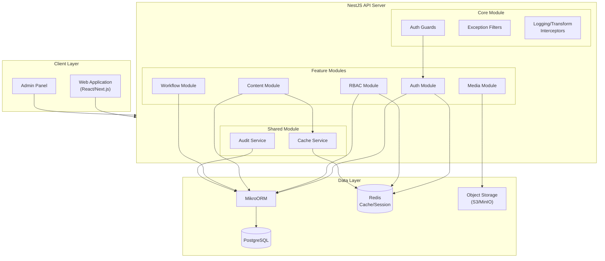

## NestJS Module Structure

```mermaid
flowchart TB
    subgraph AppModule["AppModule"]
        subgraph CoreModule["CoreModule (Global)"]
            direction TB
            AuthGuard["AuthGuard"]
            RolesGuard["RolesGuard"]
            PermissionsGuard["PermissionsGuard"]
            HttpExceptionFilter["HttpExceptionFilter"]
            LoggingInterceptor["LoggingInterceptor"]
            TransformInterceptor["TransformInterceptor"]
        end

        subgraph SharedModule["SharedModule (Global)"]
            direction TB
            AuditSvc["AuditService"]
            CacheSvc["CacheService"]
            PaginationSvc["PaginationService"]
        end

        subgraph AuthMod["AuthModule"]
            AuthController["AuthController"]
            AuthService["AuthService"]
            JwtStrategy["JwtStrategy"]
            UserEntity["User Entity"]
            SessionEntity["Session Entity"]
        end

        subgraph RBACMod["RBACModule"]
            RoleController["RoleController"]
            PermissionController["PermissionController"]
            RBACService["RBACService"]
            RoleEntity["Role Entity"]
            PermissionEntity["Permission Entity"]
        end

        subgraph ContentMod["ContentModule"]
            ContentController["ContentController"]
            ProductController["ProductController"]
            BlogController["BlogController"]
            ContentSvc["ContentService"]
            ProductSvc["ProductService"]
            BlogSvc["BlogService"]
            ContentEntity["Content Entity"]
            ProductEntity["Product Entity"]
            BlogEntity["Blog Entity"]
        end

        subgraph WorkflowMod["WorkflowModule"]
            WorkflowController["WorkflowController"]
            WorkflowSvc["WorkflowService"]
            ApprovalSvc["ApprovalService"]
            WorkflowEntity["Workflow Entity"]
            ApprovalEntity["Approval Entity"]
            WorkflowConfigEntity["WorkflowConfig Entity"]
        end

        subgraph MediaMod["MediaModule"]
            MediaController["MediaController"]
            MediaSvc["MediaService"]
            StorageSvc["StorageService"]
            MediaEntity["Media Entity"]
        end
    end

    CoreModule --> SharedModule
    AuthMod --> CoreModule
    RBACMod --> CoreModule
    ContentMod --> CoreModule
    ContentMod --> WorkflowMod
    WorkflowMod --> CoreModule
    MediaMod --> CoreModule
```

## RBAC Model

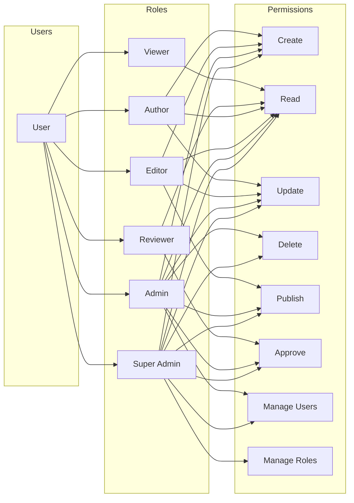

## Polymorphic Workflow System

The workflow system supports approval processes for multiple entity types using a polymorphic design pattern. Currently active for content; other entity types are designed for future use.

### Supported Entity Types

| Entity Type | Description | Status |
|-------------|-------------|--------|
| `content` | Blog posts, products, pages | **Active** |
| `role` | RBAC roles | Future |
| `permission` | RBAC permissions | Future |
| `user_role` | User-role assignments | Future |

### Workflow Architecture

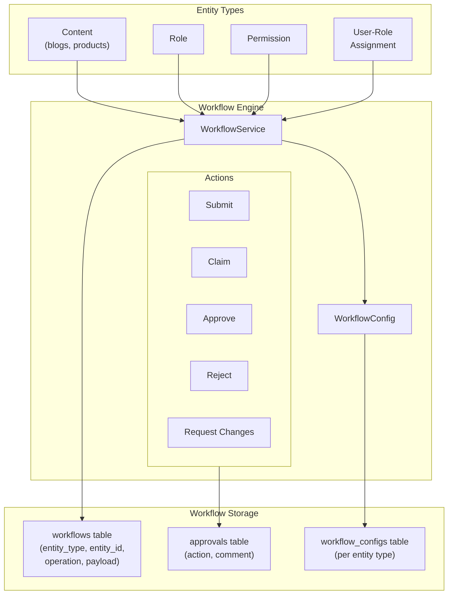

### Workflow Entity Schema

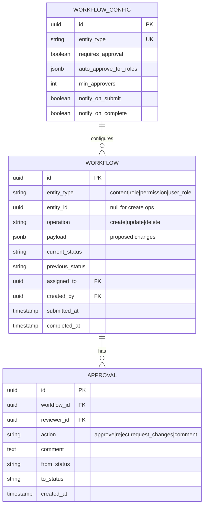

## Workflow State Machine

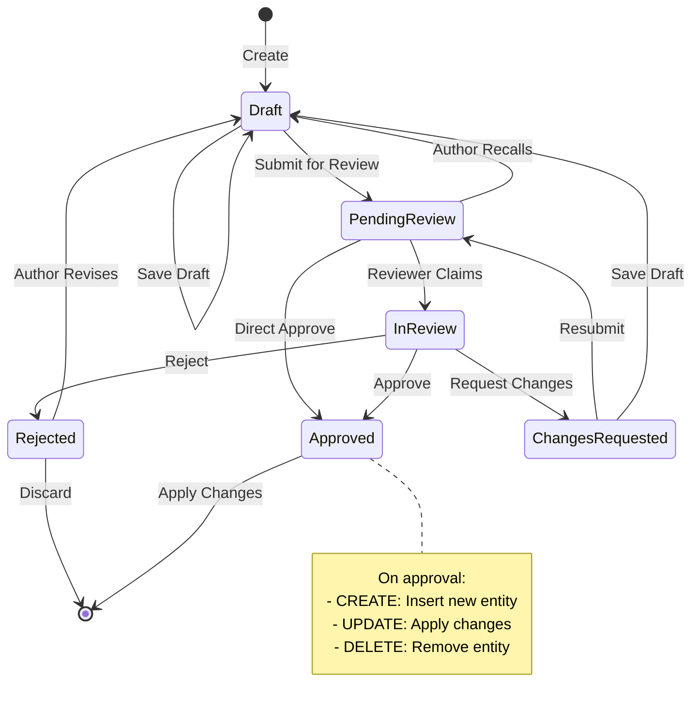

### Content-Specific Extended States

For content entities, additional states are available after approval:

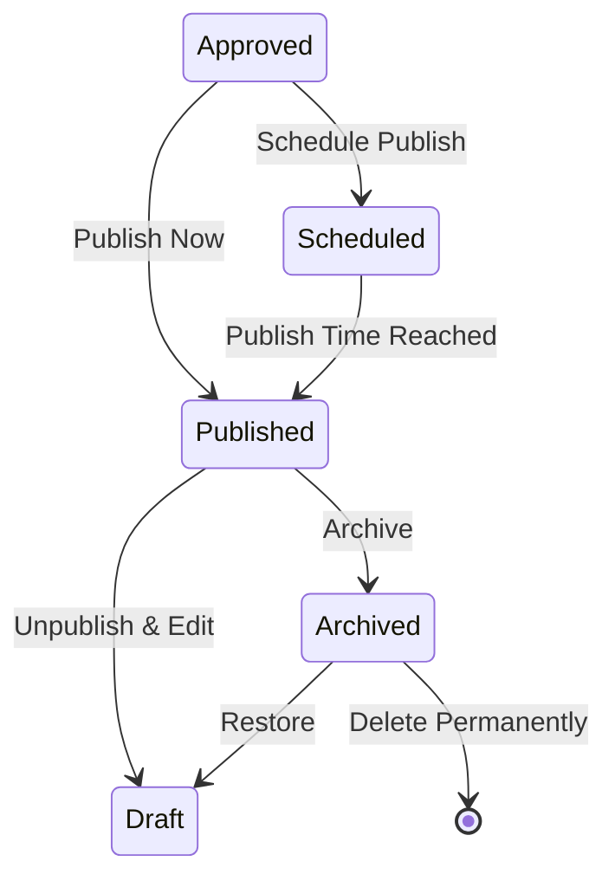

## Request Flow: Create Role (RBAC)

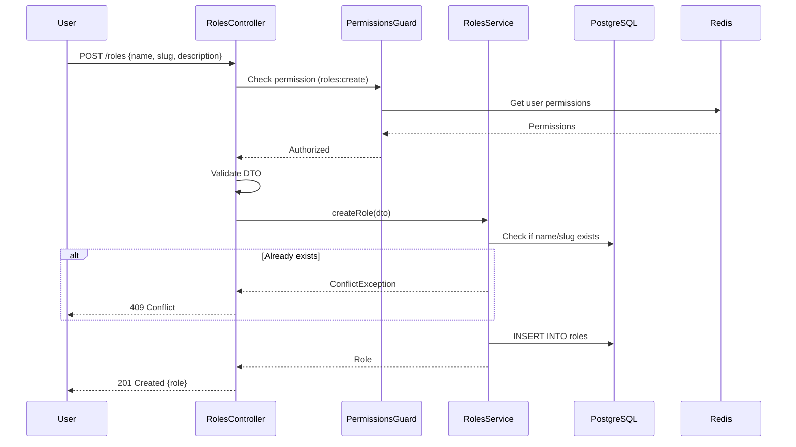

> **Future Enhancement**: The workflow system is designed to support RBAC approval flows. See `docs/schema/workflow.dbml` for the polymorphic workflow schema that can be enabled for roles, permissions, and user-role assignments.

## Request Flow: Content with RBAC & Approval

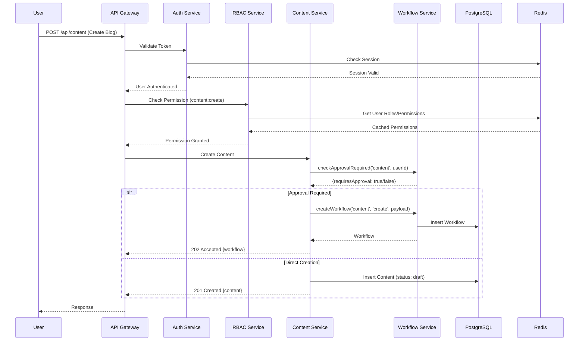

## Workflow Configuration

Each entity type can be configured independently:

```json
{
  "entityType": "role",
  "requiresApproval": true,
  "autoApproveForRoles": ["super-admin", "admin"],
  "minApprovers": 1,
  "notifyOnSubmit": true,
  "notifyOnComplete": true
}
```

### Configuration Options

| Option | Type | Description |
|--------|------|-------------|
| `requiresApproval` | boolean | Whether this entity type requires approval workflow |
| `autoApproveForRoles` | string[] | Role slugs that bypass the approval process |
| `minApprovers` | number | Minimum number of approvals required |
| `notifyOnSubmit` | boolean | Send notifications when workflow submitted |
| `notifyOnComplete` | boolean | Send notifications when workflow completed |

## Content Types & Polymorphic Structure

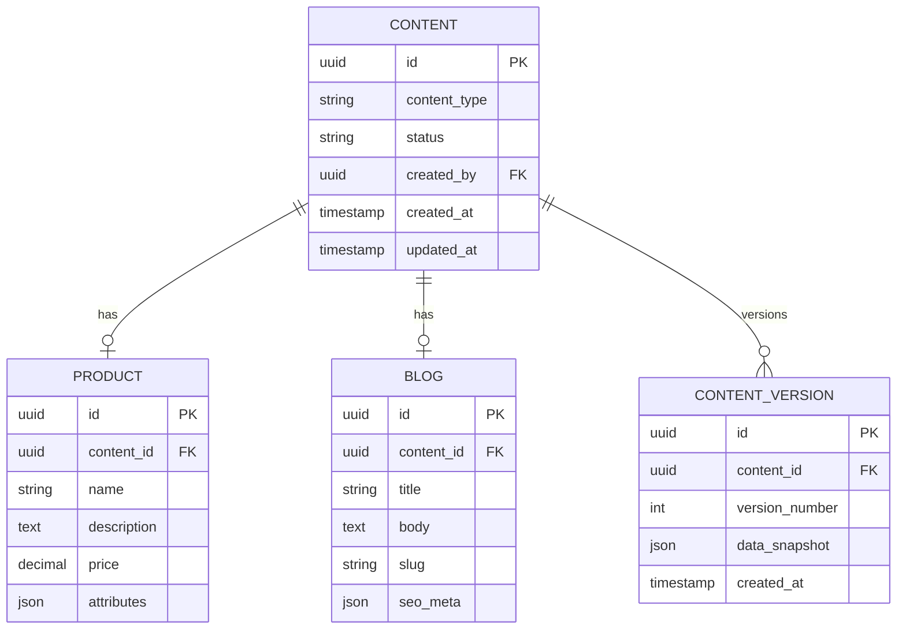

## Module Dependencies

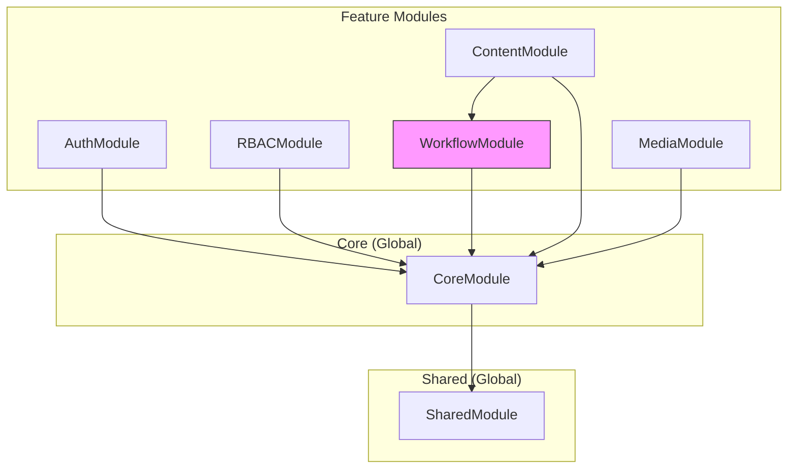

> **Note**: RBAC currently operates without workflow integration. The polymorphic workflow system is designed to support RBAC approval flows in the future (dashed line represents future integration).

## Deployment Architecture

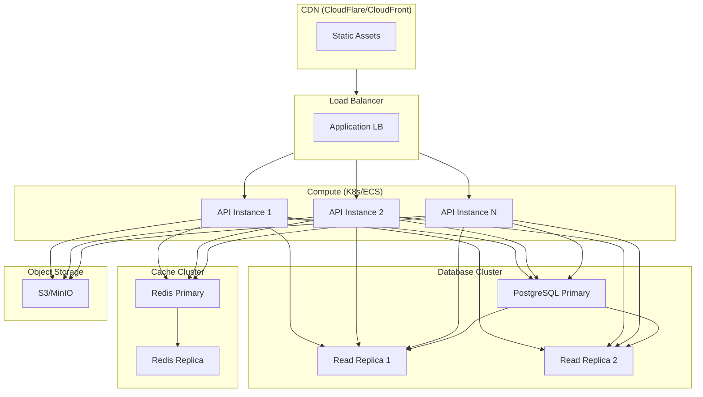
