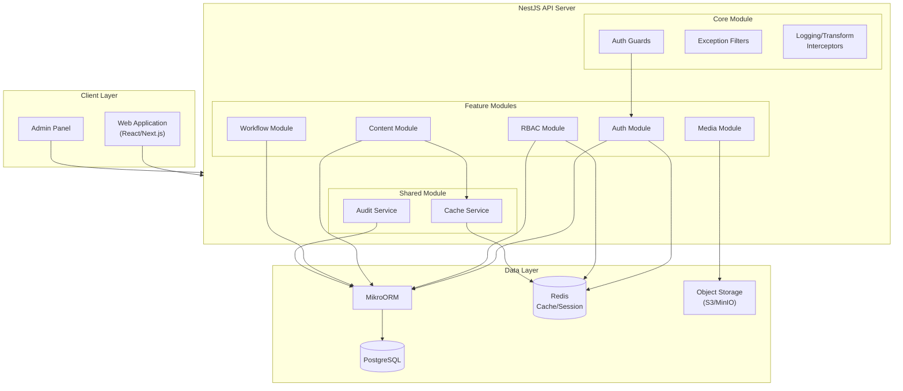
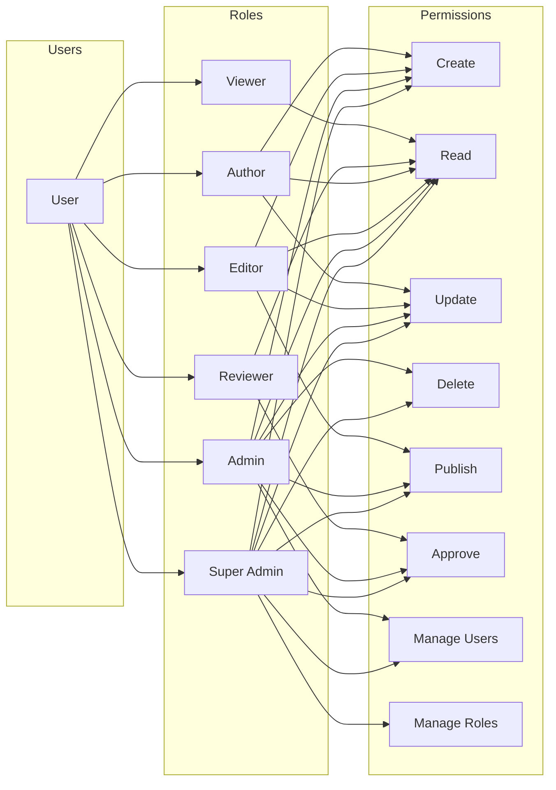
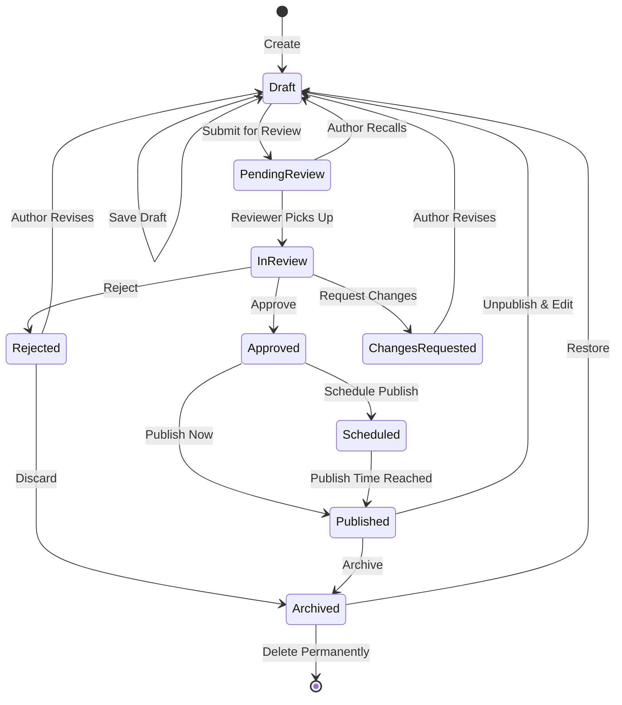
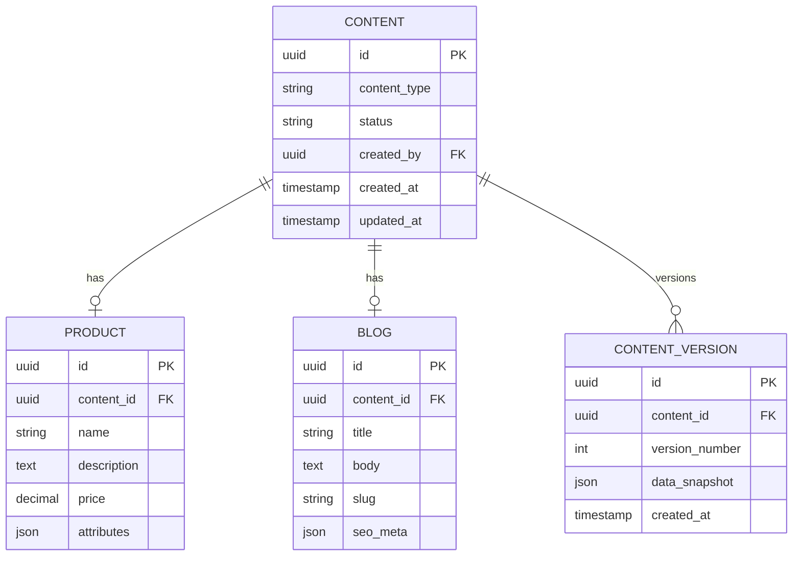
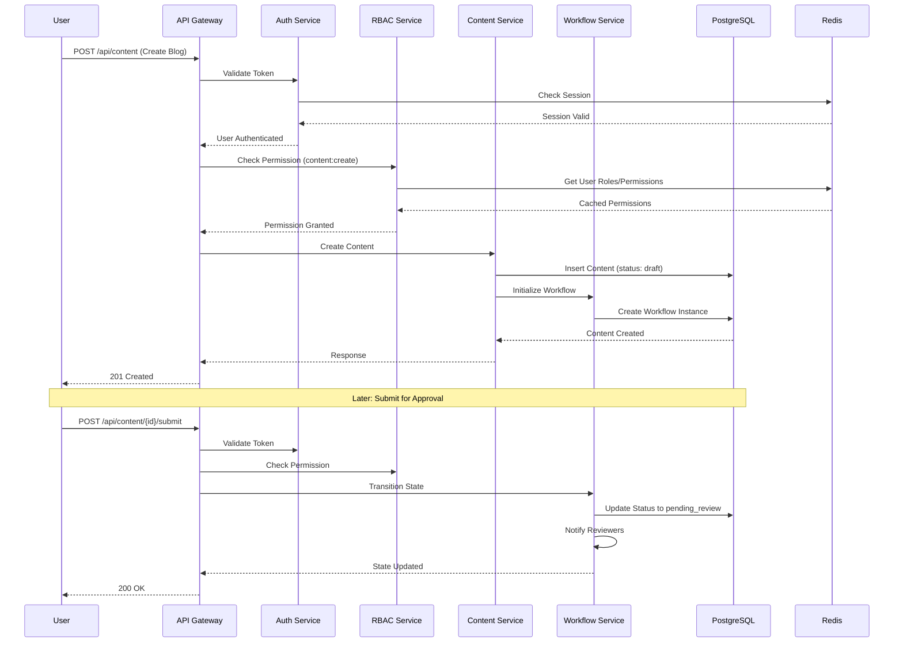
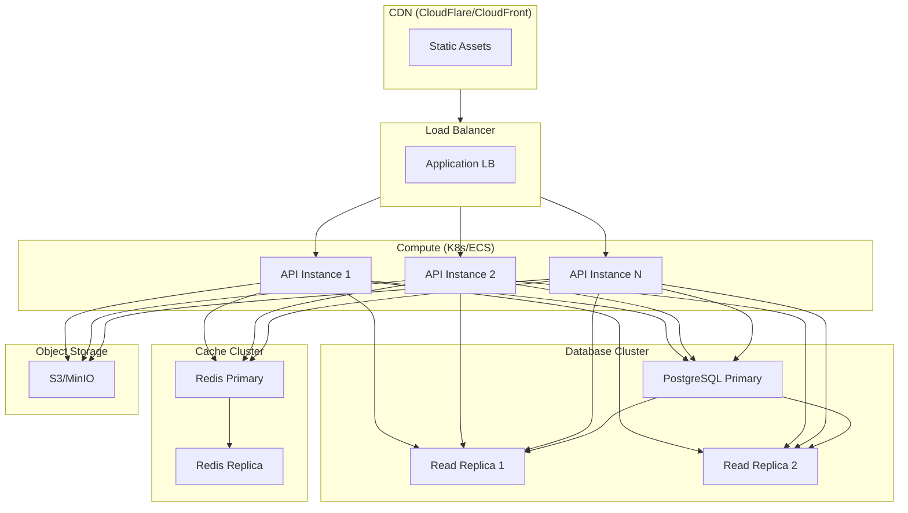

# CMS System Architecture

## High-Level System Architecture

## NestJS Module Structure

```mermaid
flowchart TB
    subgraph AppModule["AppModule"]
        subgraph CoreModule["CoreModule (Global)"]
            direction TB
            AuthGuard["AuthGuard"]
            RolesGuard["RolesGuard"]
            PermissionsGuard["PermissionsGuard"]
            HttpExceptionFilter["HttpExceptionFilter"]
            LoggingInterceptor["LoggingInterceptor"]
            TransformInterceptor["TransformInterceptor"]
        end

        subgraph SharedModule["SharedModule (Global)"]
            direction TB
            AuditSvc["AuditService"]
            CacheSvc["CacheService"]
            PaginationSvc["PaginationService"]
        end

        subgraph AuthMod["AuthModule"]
            AuthController["AuthController"]
            AuthService["AuthService"]
            JwtStrategy["JwtStrategy"]
            UserEntity["User Entity"]
            SessionEntity["Session Entity"]
        end

        subgraph RBACMod["RBACModule"]
            RoleController["RoleController"]
            PermissionController["PermissionController"]
            RBACService["RBACService"]
            RoleEntity["Role Entity"]
            PermissionEntity["Permission Entity"]
        end

        subgraph ContentMod["ContentModule"]
            ContentController["ContentController"]
            ProductController["ProductController"]
            BlogController["BlogController"]
            ContentSvc["ContentService"]
            ProductSvc["ProductService"]
            BlogSvc["BlogService"]
            ContentEntity["Content Entity"]
            ProductEntity["Product Entity"]
            BlogEntity["Blog Entity"]
        end

        subgraph WorkflowMod["WorkflowModule"]
            WorkflowController["WorkflowController"]
            WorkflowSvc["WorkflowService"]
            ApprovalSvc["ApprovalService"]
            WorkflowEntity["Workflow Entity"]
            ApprovalEntity["Approval Entity"]
        end

        subgraph MediaMod["MediaModule"]
            MediaController["MediaController"]
            MediaSvc["MediaService"]
            StorageSvc["StorageService"]
            MediaEntity["Media Entity"]
        end
    end

    CoreModule --> SharedModule
    AuthMod --> CoreModule
    RBACMod --> CoreModule
    ContentMod --> CoreModule
    ContentMod --> WorkflowMod
    WorkflowMod --> CoreModule
    MediaMod --> CoreModule
```

## RBAC Model

## Content Approval Workflow

## Content Types & Polymorphic Structure

## Request Flow with RBAC & Approval

## Deployment Architecture

