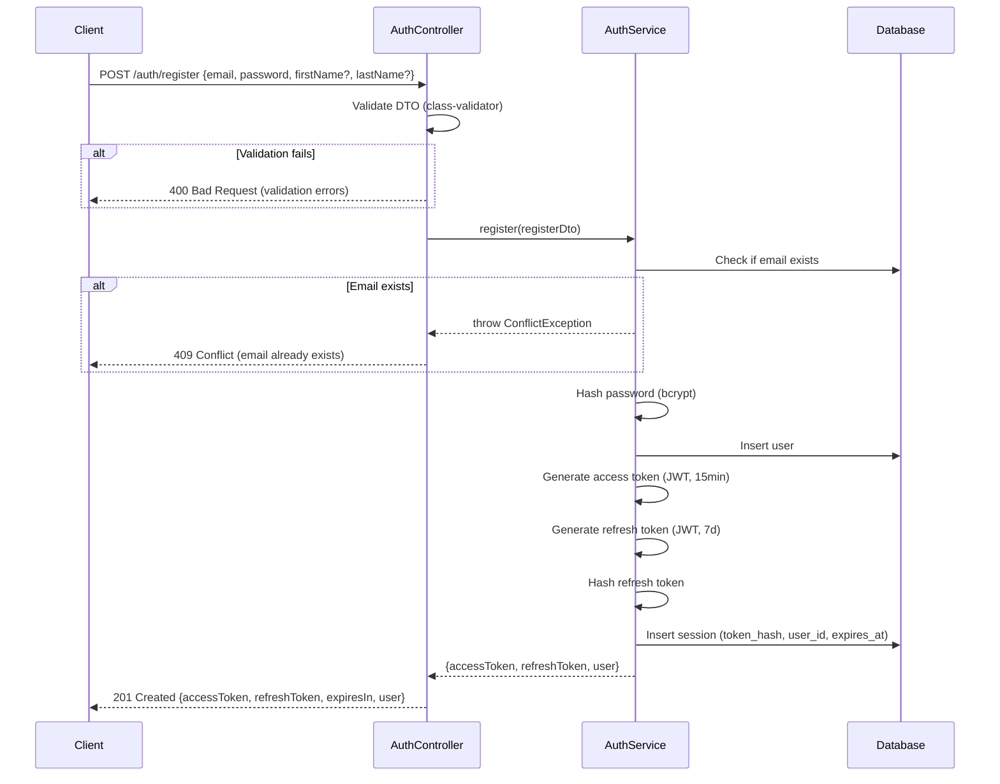
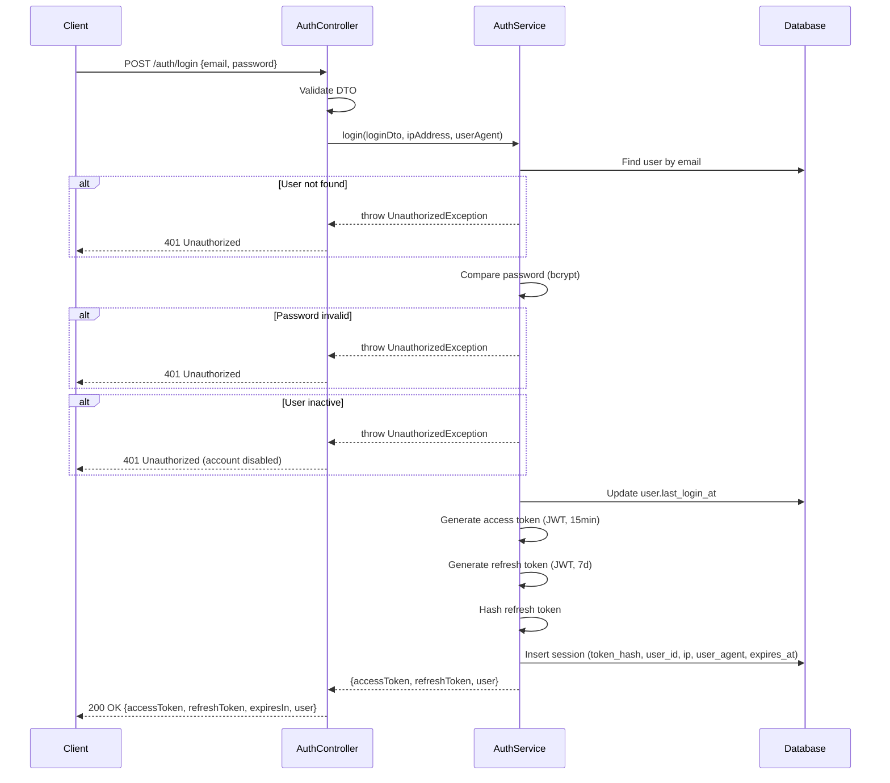
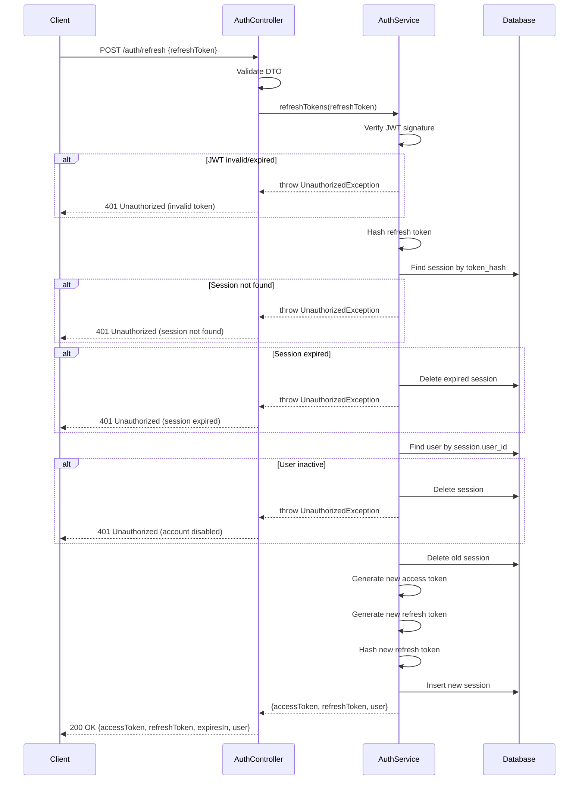
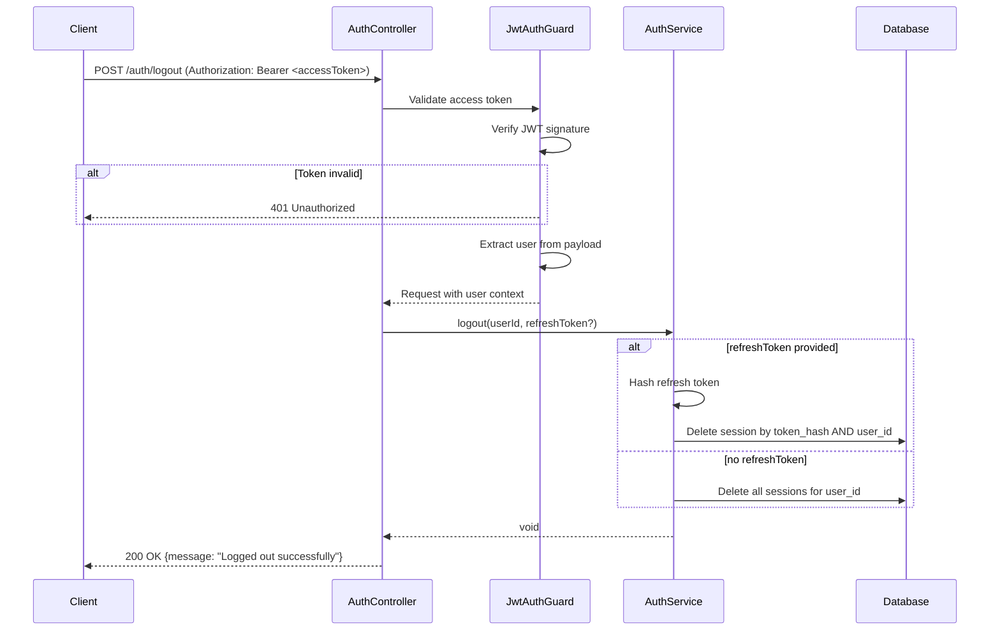
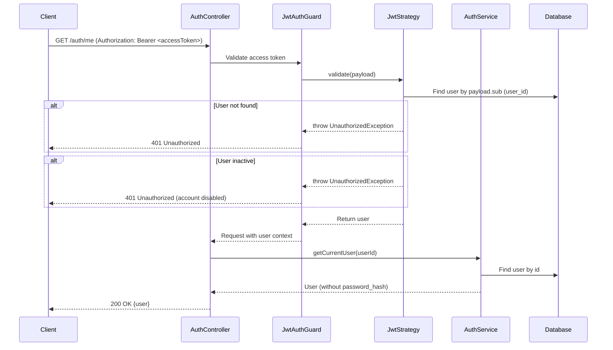

# Auth Module Sequence Diagrams

## 1. User Registration Flow



## 2. User Login Flow



## 3. Token Refresh Flow



## 4. Logout Flow



## 5. Get Current User Flow



## Token Structure

### Access Token Payload
```json
{
  "sub": "user-uuid",
  "email": "user@example.com",
  "type": "access",
  "iat": 1234567890,
  "exp": 1234568790
}
```

### Refresh Token Payload
```json
{
  "sub": "user-uuid",
  "type": "refresh",
  "jti": "unique-token-id",
  "iat": 1234567890,
  "exp": 1235172690
}
```

## Security Notes

1. **Password Hashing**: bcrypt with cost factor 12
2. **Refresh Token Storage**: Only hash stored in DB, never plain token
3. **Token Expiry**: Access 15min, Refresh 7 days
4. **Session Tracking**: IP address and user agent stored for audit
5. **Token Rotation**: Refresh token rotated on each use (old session deleted)
