# Content Module Sequence Diagrams

## Architecture: Hybrid Controller Pattern

- **Type-specific endpoints** (`/blogs`, `/products`) for CRUD operations
- **Unified endpoints** (`/contents`) for cross-type queries and version management

---

## 1. Create Blog

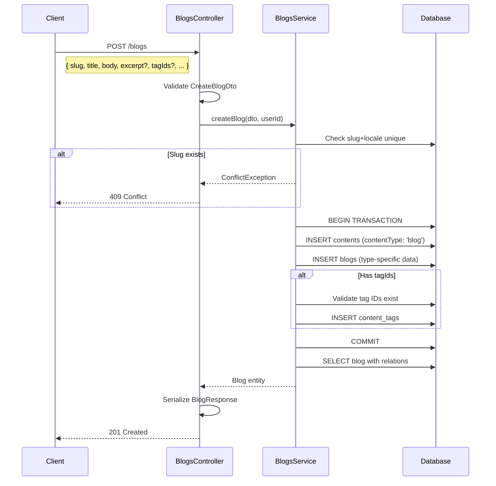

## 2. Get Blog by ID

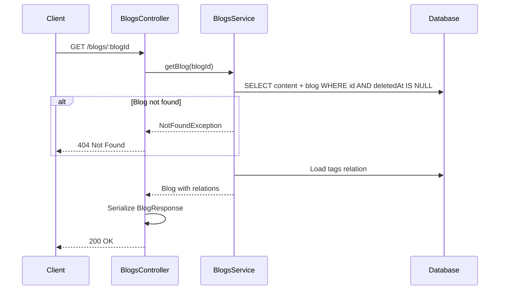

## 3. Get Any Content by ID (Unified)

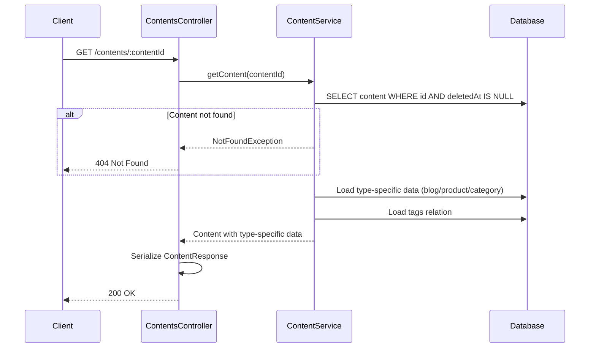

## 4. Update Blog

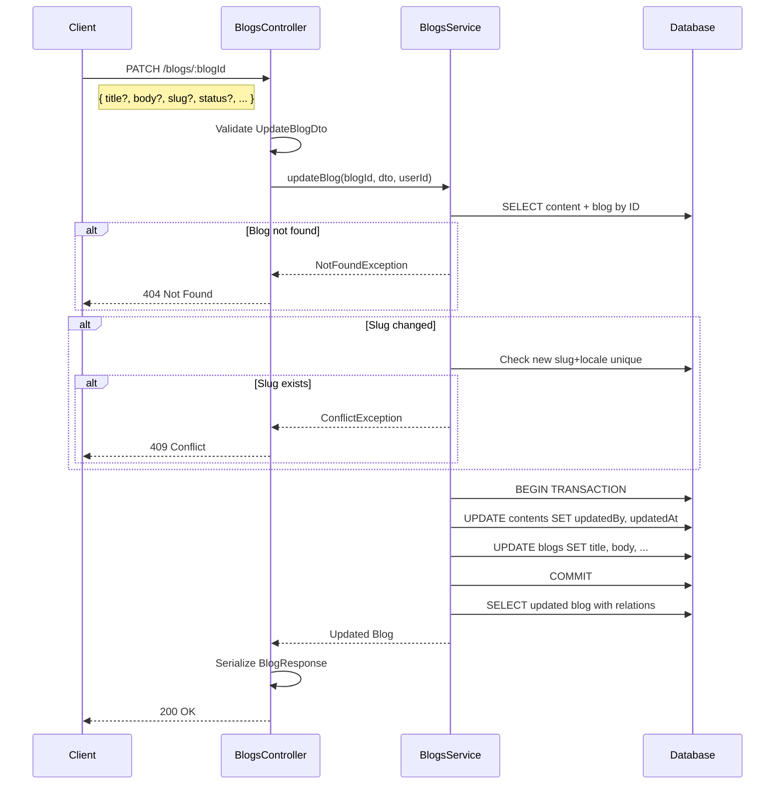

## 5. Create Content Version (Manual)

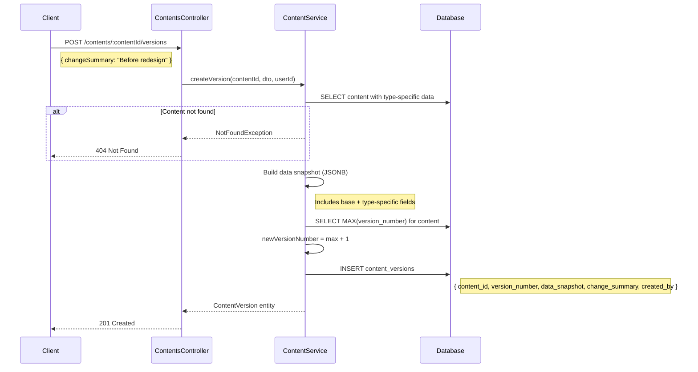

## 6. Restore Content to Version

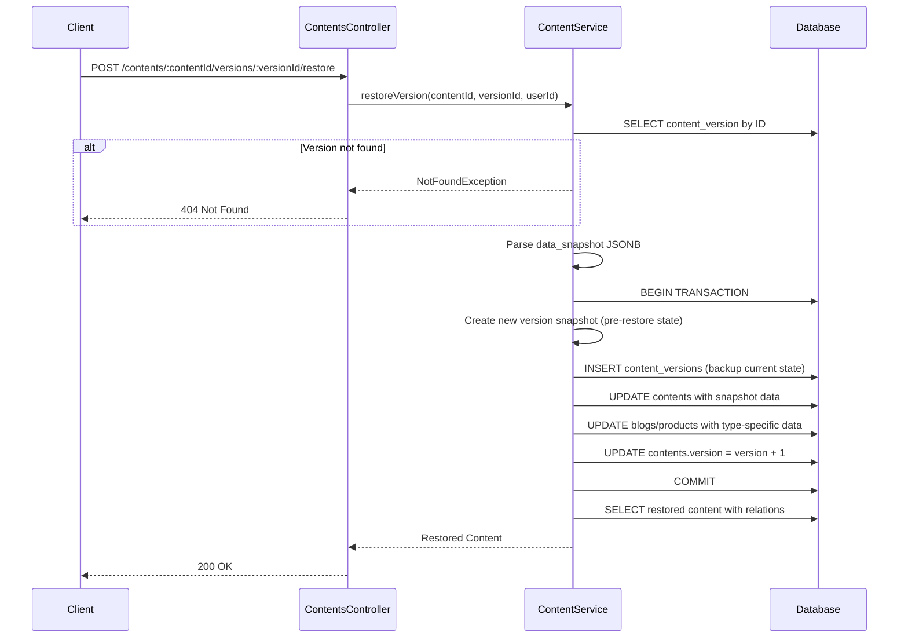

## 7. Add Tags to Blog

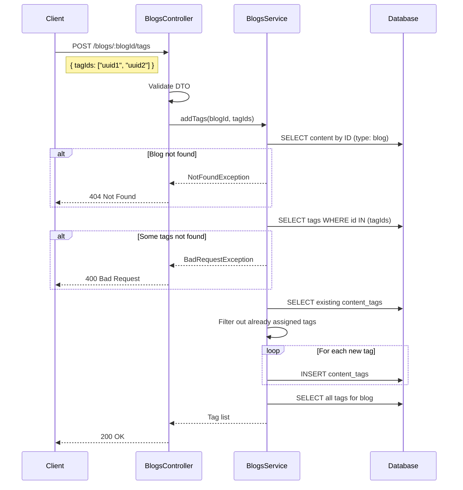

## 8. List All Contents (Unified)

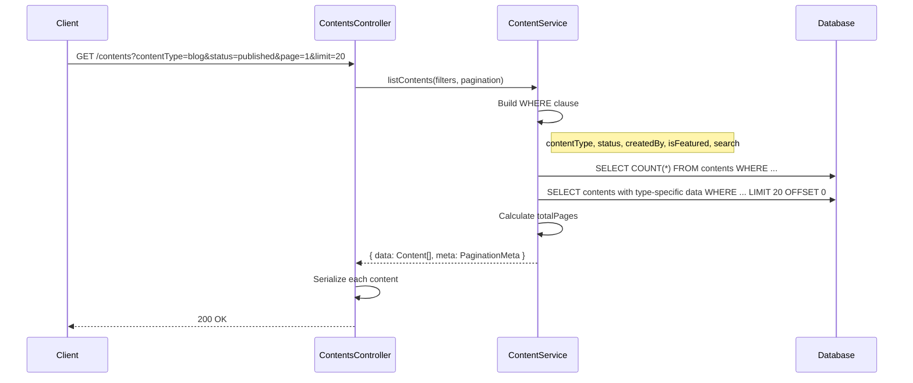

## 9. List Blogs (Type-Specific)

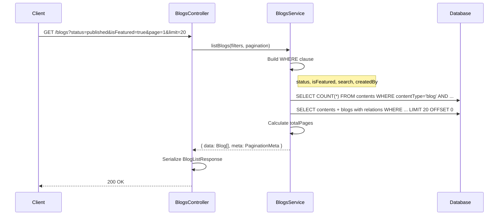

## 10. Tag CRUD Operations

### Create Tag
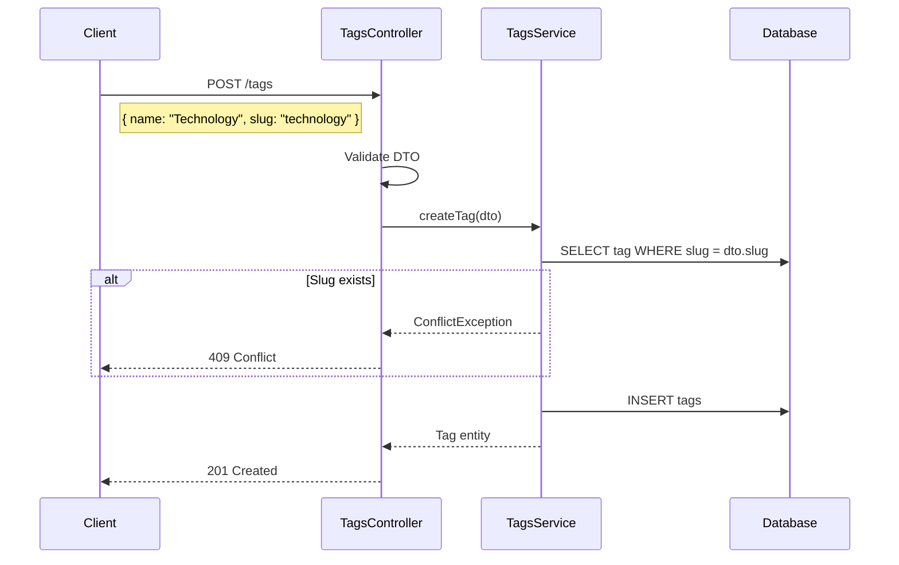

### List Tags
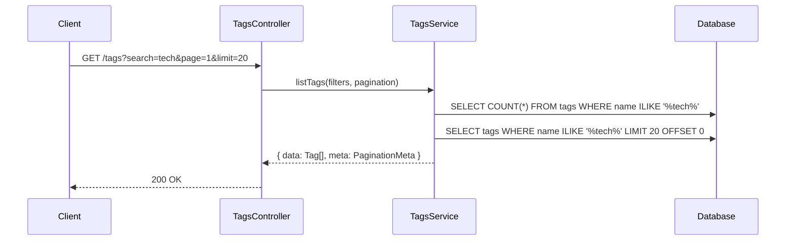

### Delete Tag
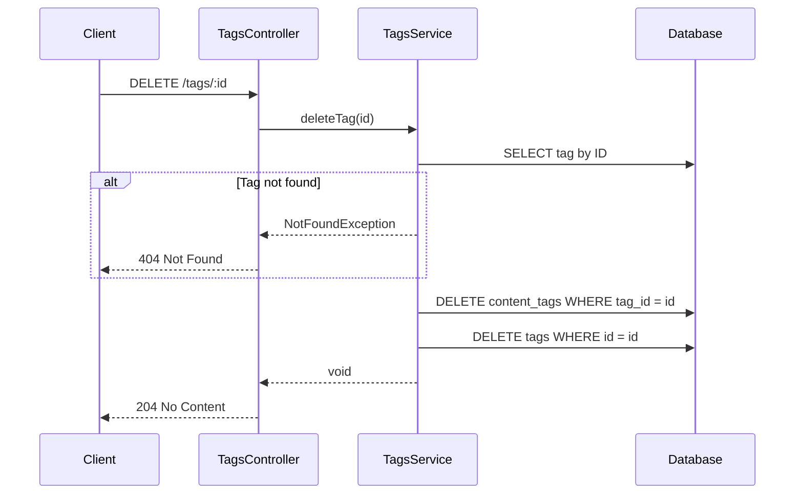

## 11. Publish Blog (Auto-Version)

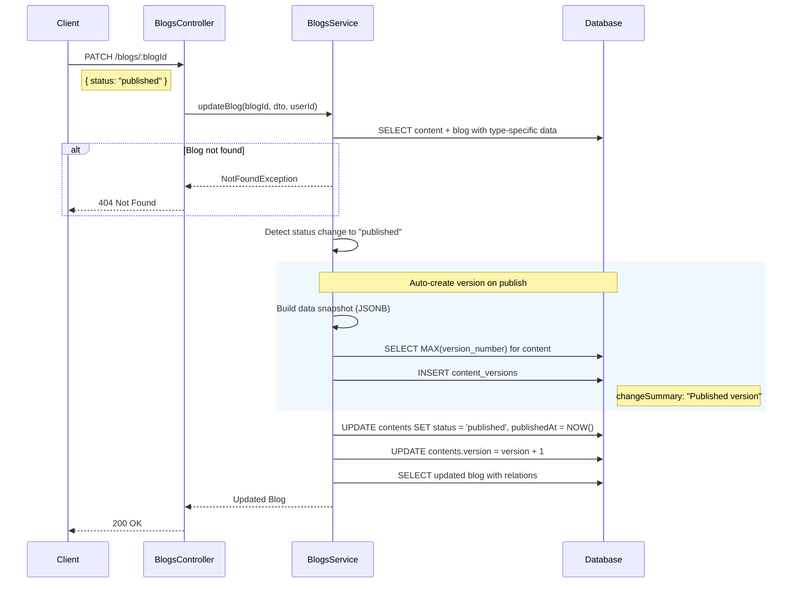

## 12. Soft Delete Blog

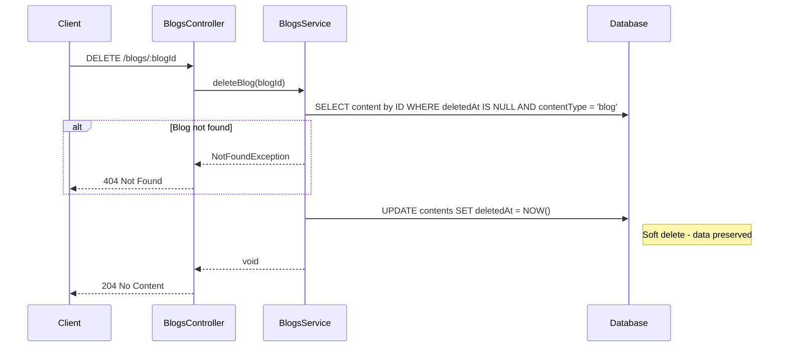

---

## Endpoint Summary (Hybrid Pattern)

### Type-Specific Endpoints (Blogs)
| Method | Endpoint | Description |
|--------|----------|-------------|
| POST | /blogs | Create blog |
| GET | /blogs | List blogs (filtered) |
| GET | /blogs/:blogId | Get blog by ID |
| PATCH | /blogs/:blogId | Update blog |
| DELETE | /blogs/:blogId | Soft delete blog |
| POST | /blogs/:blogId/tags | Add tags to blog |
| GET | /blogs/:blogId/tags | Get blog's tags |
| DELETE | /blogs/:blogId/tags | Remove tags from blog |

### Unified Endpoints (Cross-Type)
| Method | Endpoint | Description |
|--------|----------|-------------|
| GET | /contents | List all content types |
| GET | /contents/:contentId | Get any content by ID |
| GET | /contents/:contentId/versions | List versions |
| POST | /contents/:contentId/versions | Create version snapshot |
| GET | /contents/:contentId/versions/:versionId | Get specific version |
| POST | /contents/:contentId/versions/:versionId/restore | Restore to version |

### Tag Endpoints
| Method | Endpoint | Description |
|--------|----------|-------------|
| POST | /tags | Create tag |
| GET | /tags | List tags |
| GET | /tags/:id | Get tag by ID |
| DELETE | /tags/:id | Delete tag |
