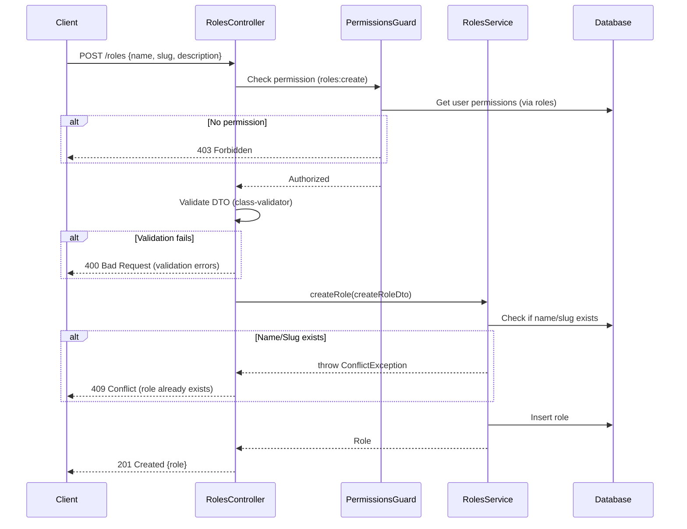
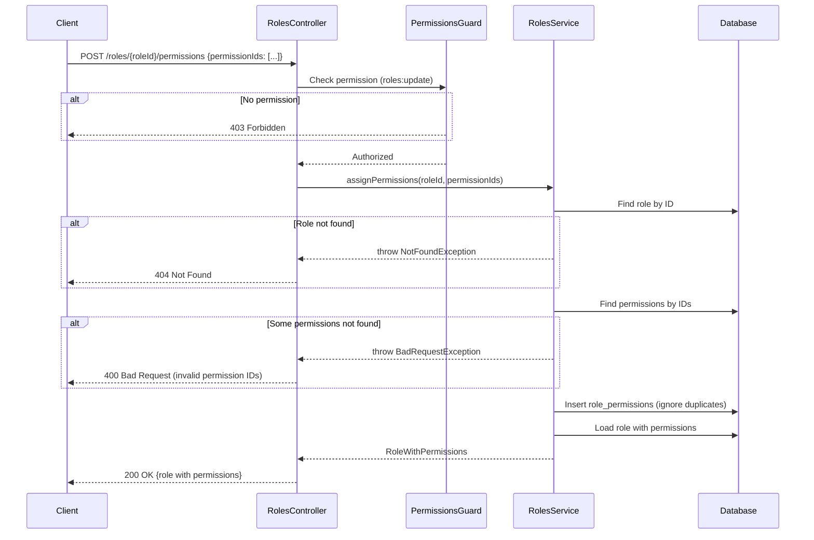
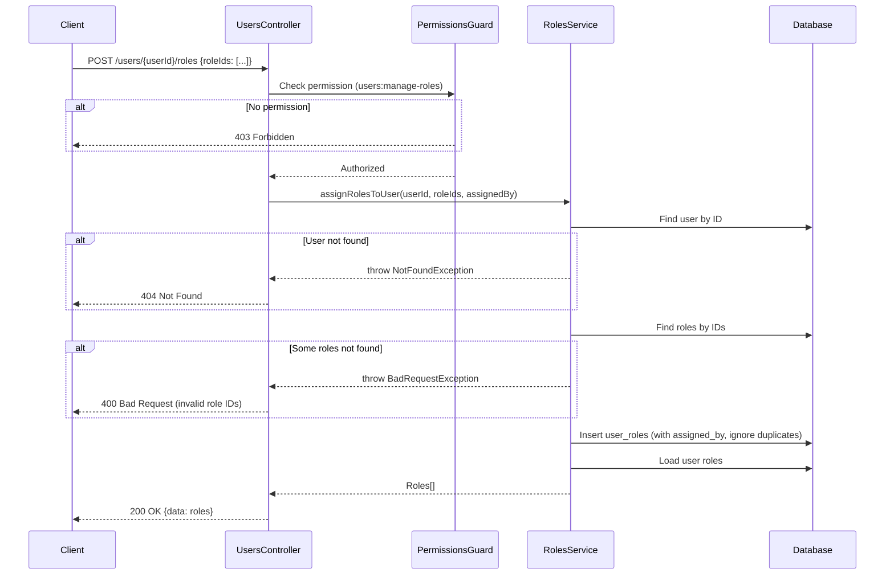
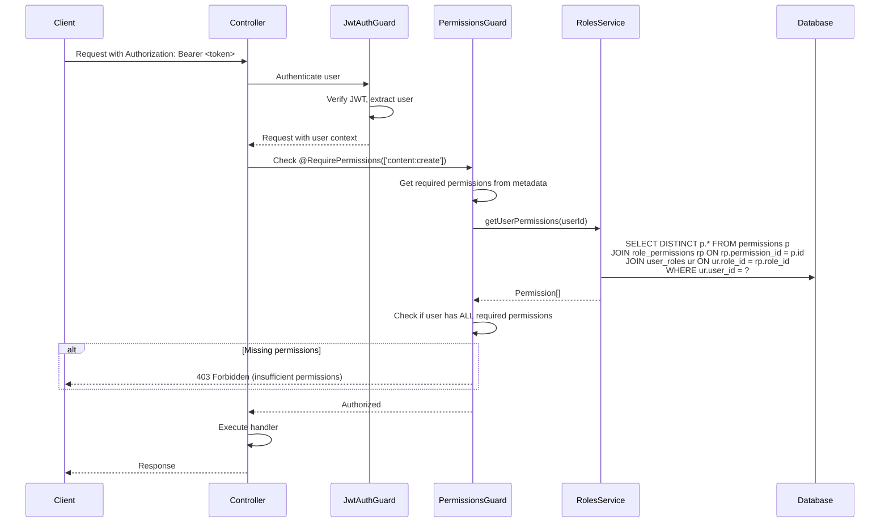
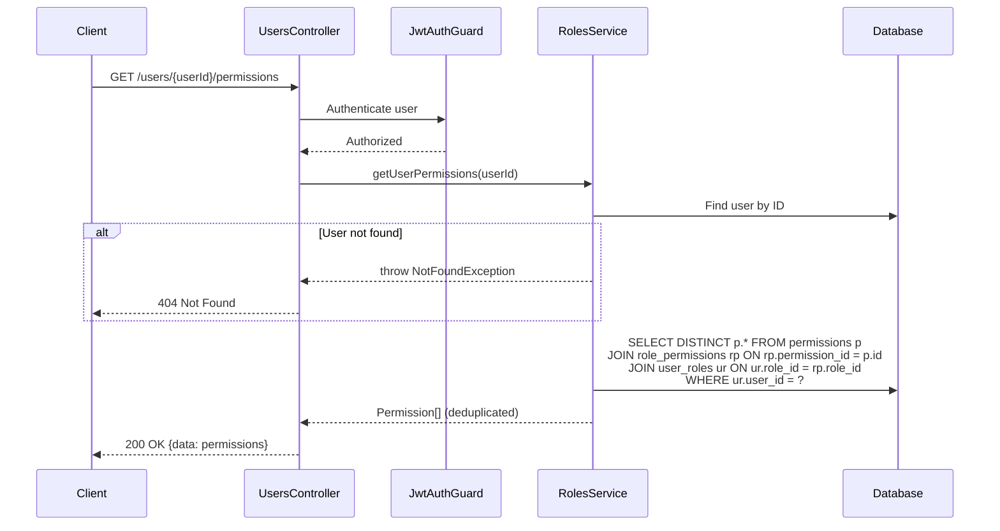
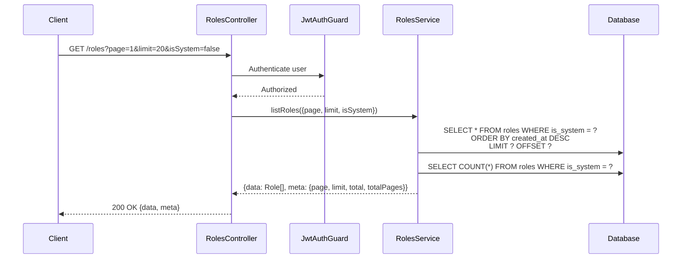
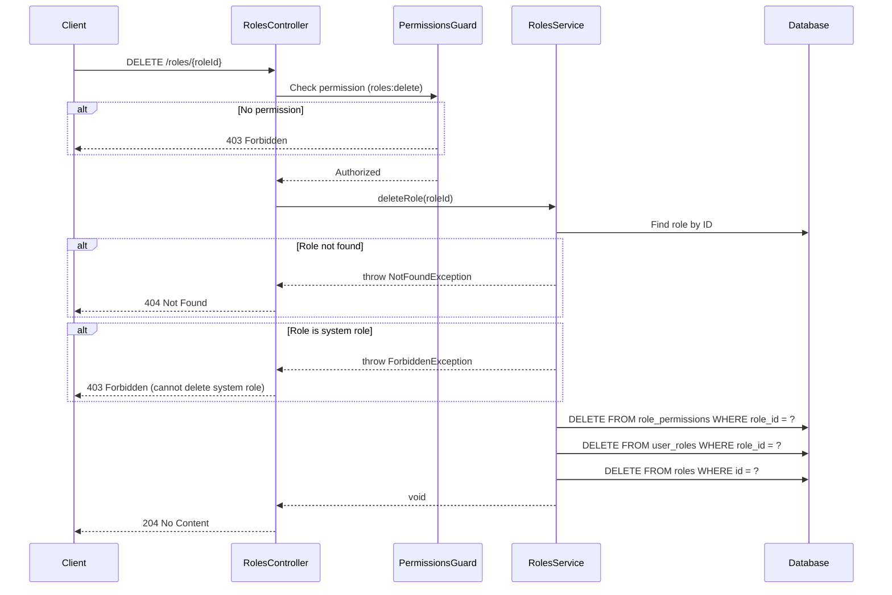
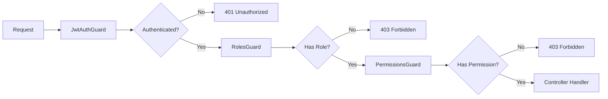

# RBAC Module Sequence Diagrams

## 1. Create Role Flow



## 2. Assign Permissions to Role Flow



## 3. Assign Roles to User Flow



## 4. Permission Check Flow (PermissionsGuard)



## 5. Get User Effective Permissions Flow



## 6. List Roles with Pagination Flow



## 7. Delete Role Flow



## Guard Architecture

### Guards Execution Order



### Decorators

```typescript
// Role-based check
@Roles('admin', 'editor')
@UseGuards(JwtAuthGuard, RolesGuard)
async createContent() {}

// Permission-based check (more granular)
@RequirePermissions('content:create')
@UseGuards(JwtAuthGuard, PermissionsGuard)
async createContent() {}

// Combined (requires both role AND permissions)
@Roles('editor')
@RequirePermissions('content:create', 'content:publish')
@UseGuards(JwtAuthGuard, RolesGuard, PermissionsGuard)
async publishContent() {}
```

## Default System Roles

| Role | Slug | Permissions |
|------|------|-------------|
| Super Admin | `super-admin` | All permissions (bypass checks) |
| Admin | `admin` | roles:*, permissions:*, users:manage-roles, content:* |
| Editor | `editor` | content:create, content:read, content:update |
| Reviewer | `reviewer` | content:read, workflow:review, workflow:approve |
| Viewer | `viewer` | content:read |

## Permission Naming Convention

Permissions follow the format: `resource:action`

| Resource | Actions |
|----------|---------|
| `roles` | create, read, update, delete |
| `permissions` | create, read, delete |
| `users` | read, update, delete, manage-roles |
| `content` | create, read, update, delete, publish |
| `workflow` | submit, review, approve, reject |
| `media` | upload, read, delete |

## Security Considerations

1. **System Roles Protection**: Roles with `is_system=true` cannot be deleted or have their slug modified
2. **Super Admin Bypass**: Users with `super-admin` role bypass all permission checks
3. **Permission Caching**: User permissions can be cached in Redis with TTL to reduce DB queries
4. **Audit Trail**: All role/permission changes should be logged via AuditService
5. **Self-Assignment Prevention**: Users cannot assign roles to themselves

---

## Future Enhancement: Workflow Integration

The RBAC module is designed to optionally integrate with the polymorphic workflow system in the future. When enabled, role/permission changes could require approval before taking effect.

See `docs/api/paths/workflows.yaml` and `docs/schema/workflow.dbml` for the workflow system design that supports:
- `content` (currently active)
- `role` (future)
- `permission` (future)
- `user_role` (future)
