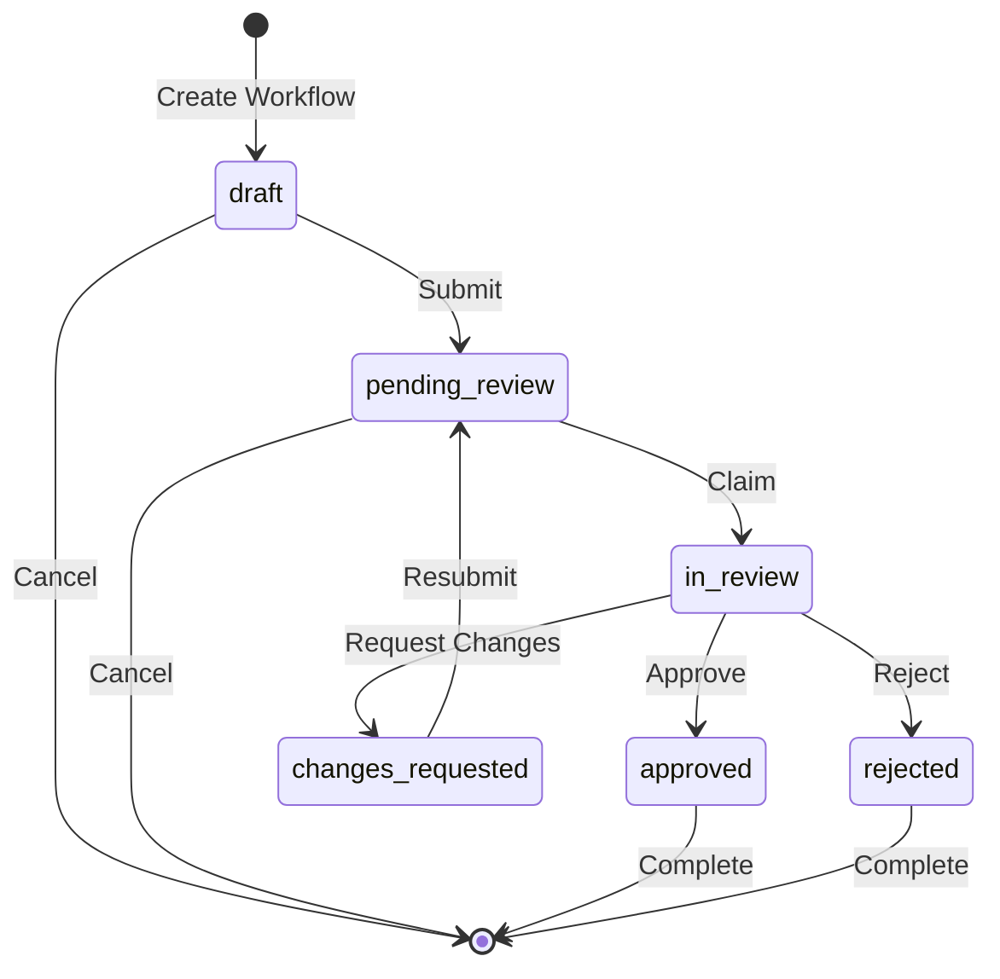
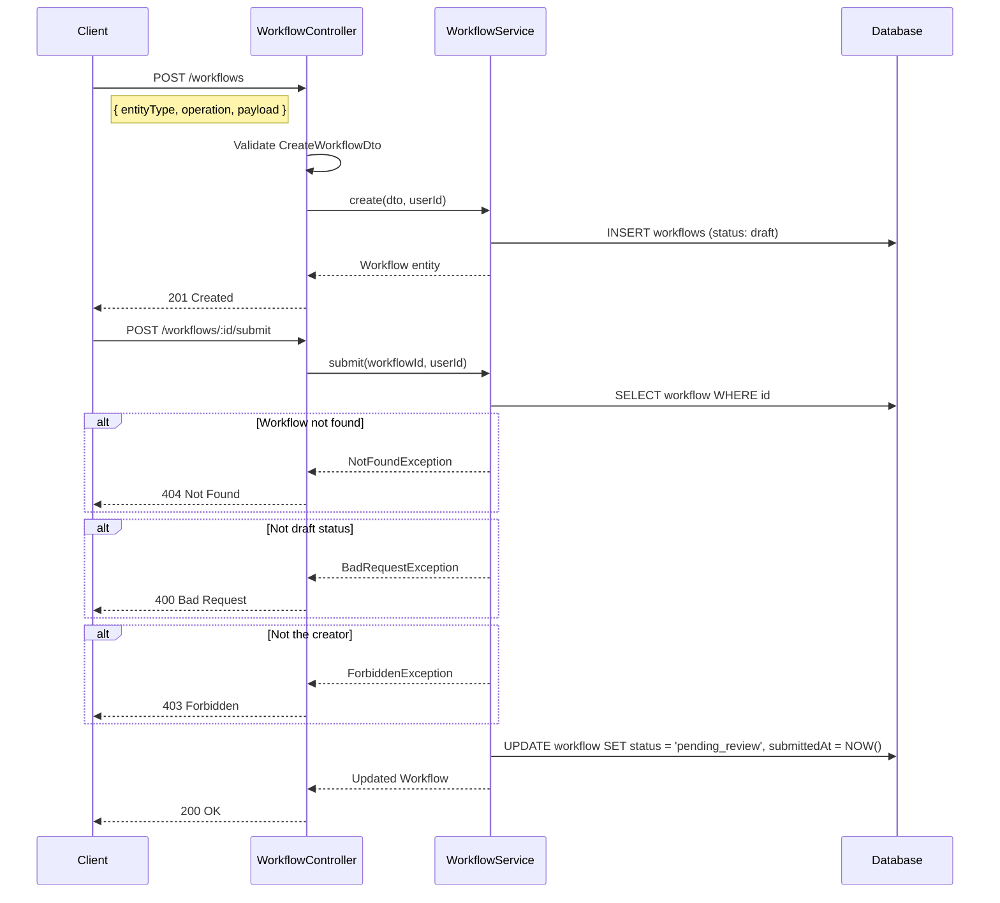
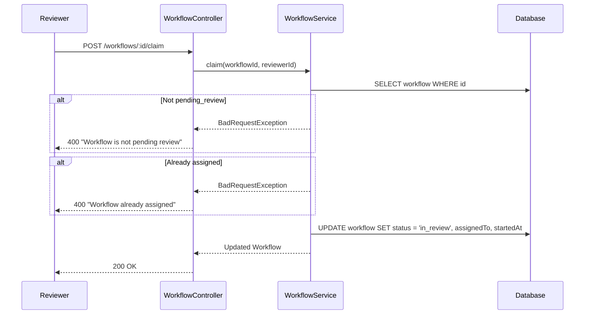
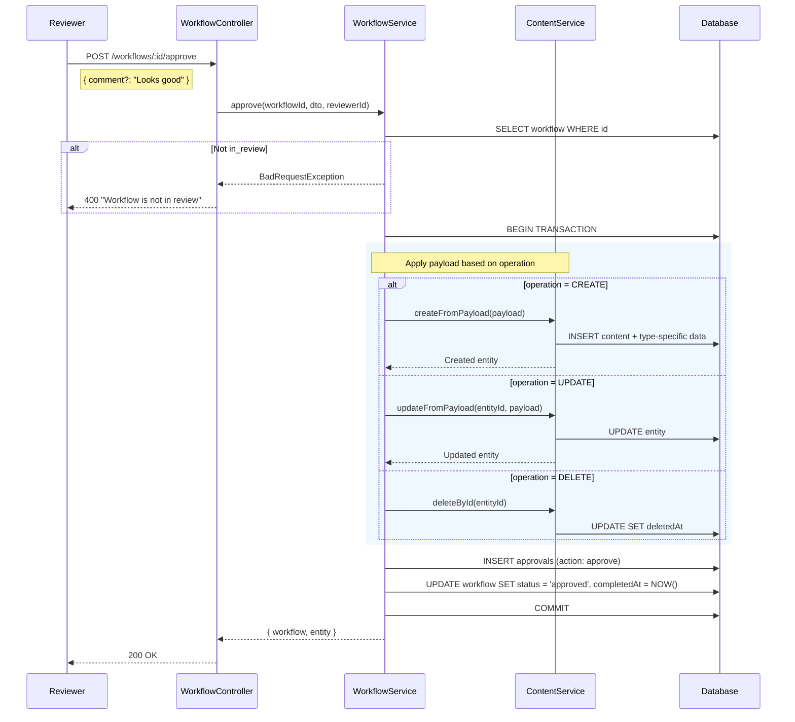
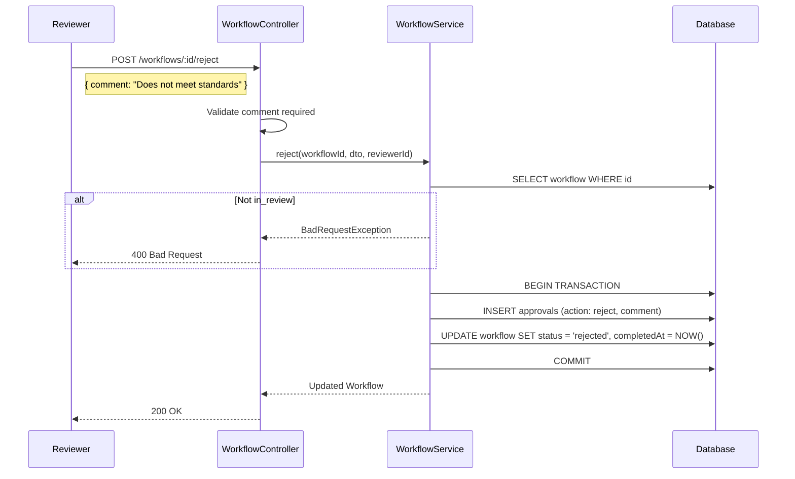
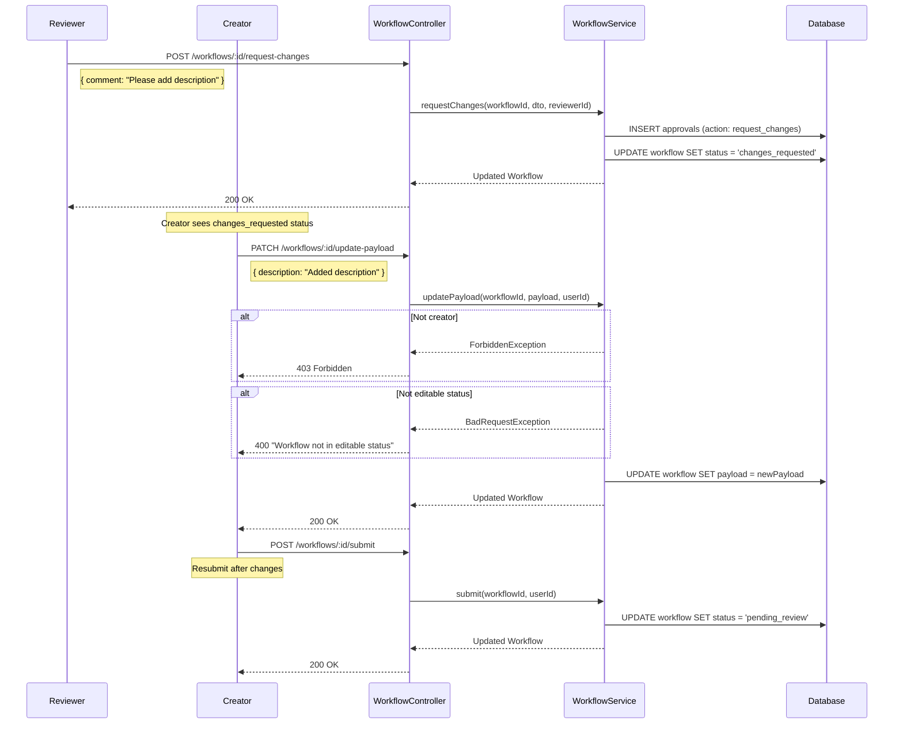
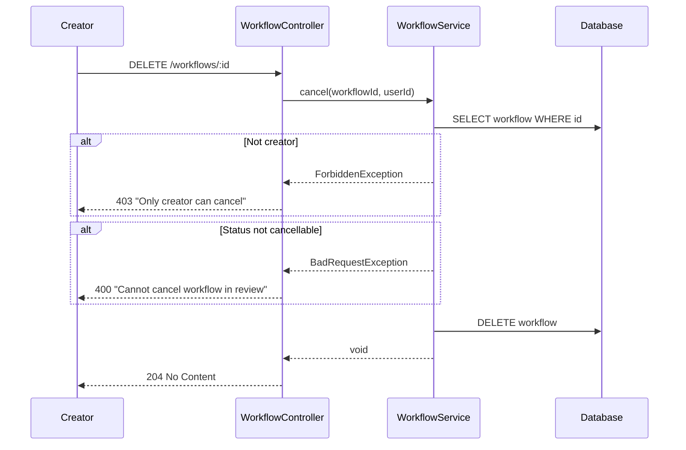

# Workflow Module Sequence Diagrams

## State Machine Overview

---

## 1. Create and Submit Workflow

---

## 2. Claim and Review Workflow

---

## 3. Approve Workflow (Content Create)

---

## 4. Reject Workflow

---

## 5. Request Changes Flow

---

## 6. Cancel Workflow

---

## Endpoint Summary

| Method | Endpoint | Description |
|--------|----------|-------------|
| POST | /workflows | Create workflow (draft) |
| GET | /workflows | List workflows (filtered) |
| GET | /workflows/:id | Get workflow with approvals |
| DELETE | /workflows/:id | Cancel workflow |
| POST | /workflows/:id/submit | Submit for review |
| POST | /workflows/:id/claim | Claim for review |
| POST | /workflows/:id/approve | Approve and apply changes |
| POST | /workflows/:id/reject | Reject with comment |
| POST | /workflows/:id/request-changes | Request changes |
| POST | /workflows/:id/comment | Add comment |
| PATCH | /workflows/:id/update-payload | Update payload |
| GET | /workflows/config | List configs |
| GET | /workflows/config/:type | Get config |
| PATCH | /workflows/config/:type | Update config |
